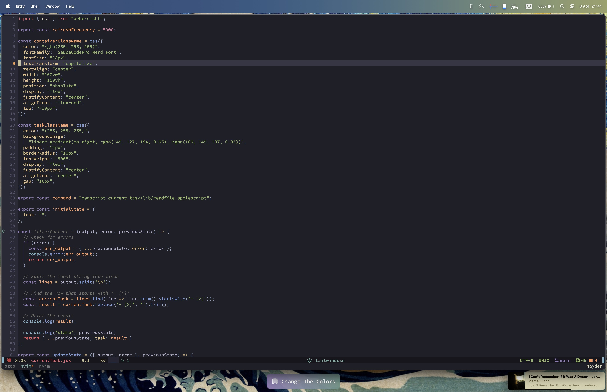
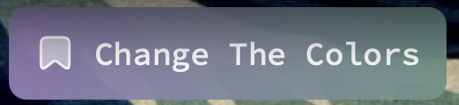

# A Simple Widget Displaying Current Task

This widget showcases your current task at the bottom of your screen, retrieved from your markdown file. The current task is identified by filtering tasks marked with '- [>]' at the beginning.






### Example Markdown File (daily.md)

```markdown
---
id: daily
aliases: []
tags: []
---

# 2024-04-09
- [x] Research GitHub APIs
- [x] Design simple commit grids
- [>] Fetch all the commits using GitHub API
```

## Usage
1. Clone this repository to your Uebersicht widget folder.
2. Update the path to your markdown file in lib/readfile.applescript.
3. Make sure your current task is marked with '- [>]'

## TODO

- [ ] Implement color customization for the widget.
- [ ] Allow users to specify the widget's location on the screen.
